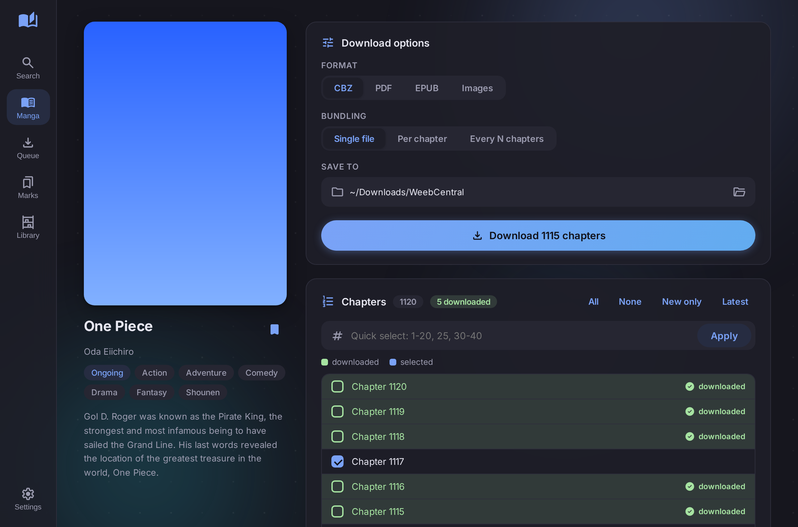
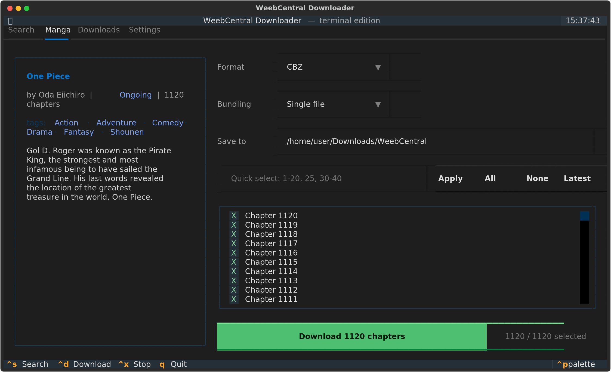
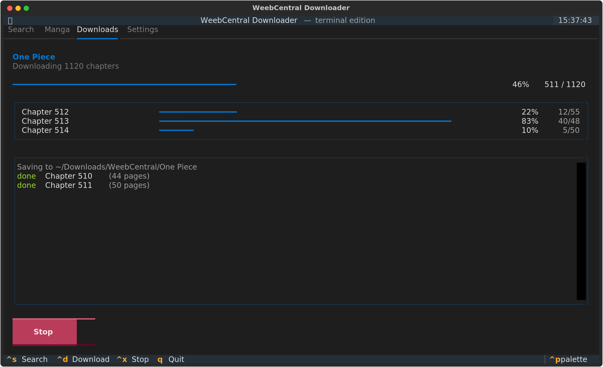
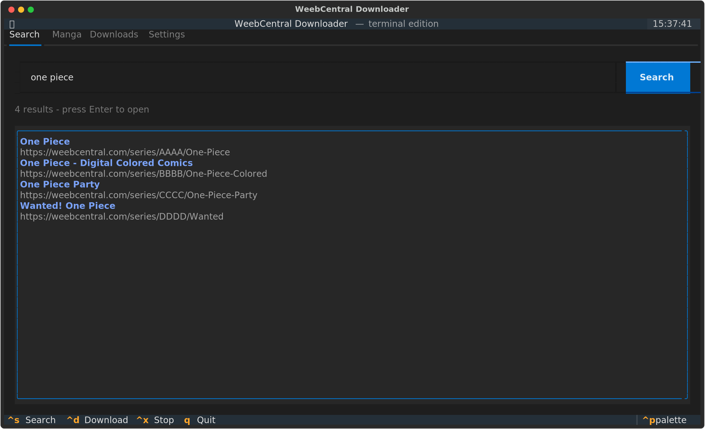
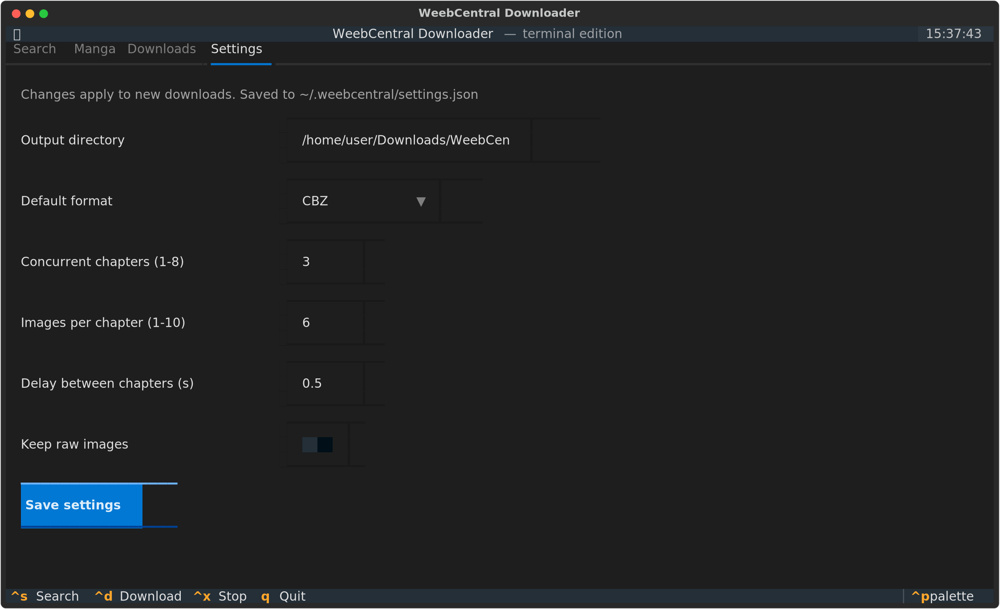
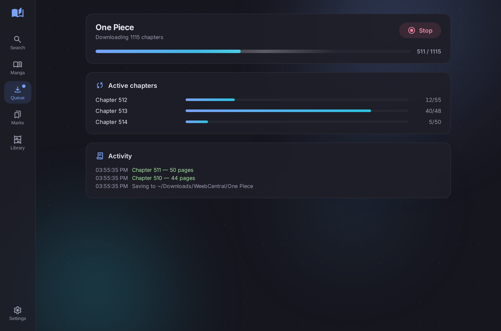
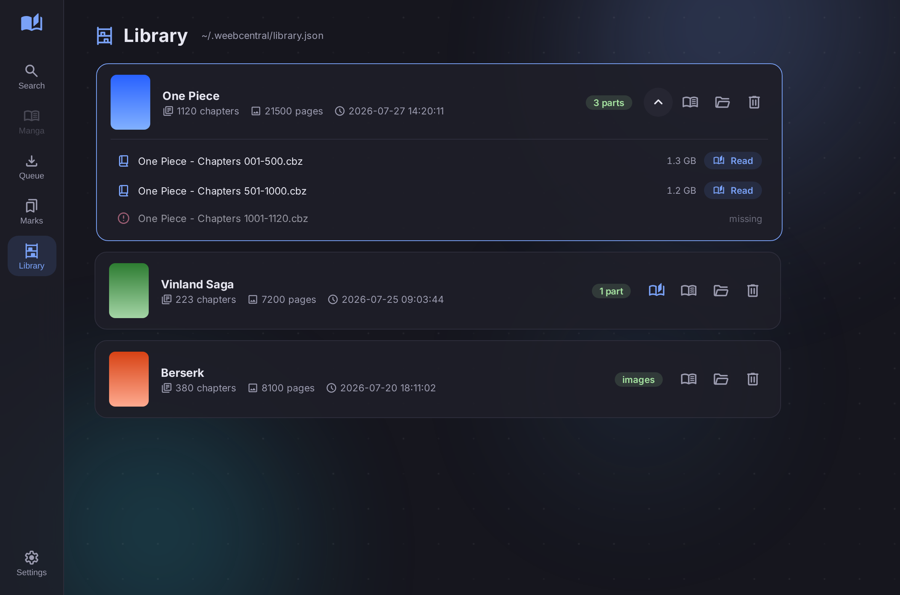
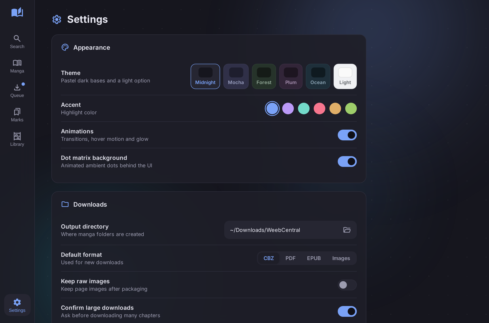
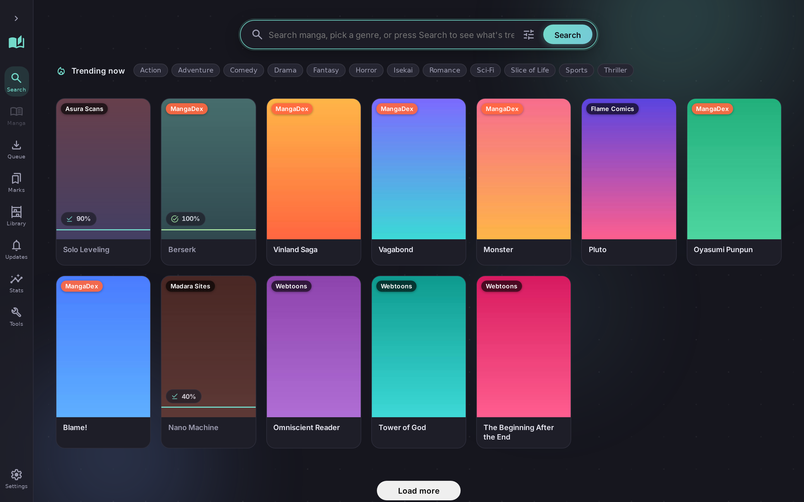
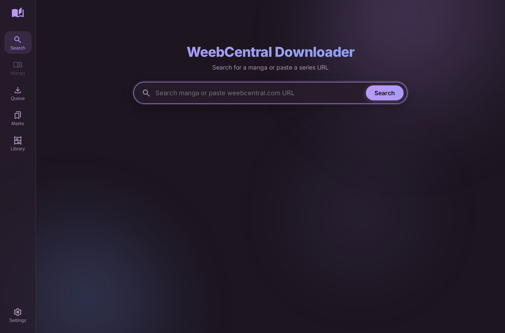

<div align="center">

# WeebCentral Downloader

**Download manga from [weebcentral.com](https://weebcentral.com) as CBZ, PDF or EPUB — from a modern CLI or a minimalist desktop GUI.**

[Project landing page](https://yui007.github.io/weebcentral_downloader/) (GitHub Pages, served from `docs/`)

[](https://python.org)
[](https://pywebview.flowrl.com)
[](LICENSE)

<br>



</div>

---

## Highlights

- **One command, one CBZ.** By default the CLI downloads *every* chapter and packs them into a single `.cbz` — no flags needed.
- **Flexible bundling.** Choose one file for everything, one file per chapter, or one file per every N chapters (`--per 10`).
- **Organized output.** Everything is sorted into a per-manga folder inside your output directory. Raw page images live in a `raw/` subfolder and are cleaned up automatically after packaging (unless you keep them).
- **Three formats.** CBZ, PDF (pages sized exactly to each image), and EPUB (chapter table of contents included). Produce several at once with `--also`.
- **Three interfaces.** A rich-powered CLI, a full-screen **terminal UI (TUI)** built with Textual, and a minimalist pywebview desktop GUI.
- **Minimalist GUI.** A pywebview desktop app with a pastel-dark ambient interface: circular gradient orbs, an animated dot-matrix backdrop, 6 themes and 6 accent colors, smooth animations. Google Material Symbols only — zero emojis.
- **Library and bookmarks.** Every downloaded chapter is recorded in `~/.weebcentral/library.json`; already-downloaded chapters are highlighted green in the chapter list, with a "New only" selector for incremental updates. Bookmark manga you want to come back to.
- **Open in Readest.** Point Settings at your reader executable (Readest or any other) and open finished books straight from the Library — multi-part downloads list every part with its size and a Read button.
- **Custom file naming.** Templates with `{title}`, `{chapter}`, `{start}`, `{end}` placeholders control output filenames, in Settings and via CLI flags.
- **Full-featured TUI.** Search, manga details, chapter multi-select with quick ranges, format/bundling pickers, live per-chapter progress and settings — entirely in your terminal (works over SSH).
- **Modern CLI.** Built on [rich](https://github.com/Textualize/rich): download plan summary, live progress bars per chapter, search and info commands.
- **Fast and polite.** Parallel chapter and image downloads with configurable workers, adaptive backoff on rate limits.
- **Crash-proof resume.** Verified checkpoints, atomic image writes and a job journal: after a crash or outage, hit **Resume** in the GUI (or run `weebcentral resume`) and it continues exactly where it left off — completed chapters skipped, partial chapters finish their missing pages only.
- **File logging.** Rotating log at `~/.weebcentral/logs/weebcentral.log`, exportable from Settings.
- **Cloudflare-ready.** Falls back to [FlareSolverr](https://github.com/FlareSolverr/FlareSolverr) automatically if the site puts up a challenge.

See **[FEATURES.md](FEATURES.md)** for the complete feature reference and
**[CHANGELOG.md](CHANGELOG.md)** for the history of every update.

---

## Installation

Requires **Python 3.9+**.

```bash
git clone https://github.com/Yui007/weebcentral_downloader.git
cd weebcentral_downloader

# install with the GUI and TUI
pip install -e ".[all]"

# or pick: CLI only / +GUI / +TUI
pip install -e .
pip install -e ".[gui]"
pip install -e ".[tui]"
```

Or without installing the package, just grab the dependencies:

```bash
pip install -r requirements.txt
```

> **Linux GUI note:** pywebview needs a webview engine. On Debian/Ubuntu:
> `sudo apt install python3-gi gir1.2-webkit2-4.1` (or install `pywebview[qt]`).
> Windows and macOS work out of the box.

---

## CLI usage

If installed with pip you get a `weebcentral` command; otherwise use `python -m weebcentral`.

### Download (the default action)

```bash
# Default: ALL chapters -> ONE .cbz, sorted into downloads/<Manga Title>/
weebcentral https://weebcentral.com/series/XXXX/some-manga

# One CBZ per 10 chapters
weebcentral <url> --per 10

# One CBZ per chapter
weebcentral <url> --per 1

# Chapters 1-50 as a single PDF
weebcentral <url> -c 1-50 -f pdf

# Latest chapter only, EPUB, custom output dir
weebcentral <url> -c latest -f epub -o ~/Manga

# CBZ volumes of 25 chapters AND a PDF of everything, keep raw images
weebcentral <url> --per 25 --also pdf --keep-images
```

### Chapter selection (`-c / --chapters`)

| Selector      | Meaning                                |
|---------------|----------------------------------------|
| `all`         | every chapter (default)                |
| `5` / `23.5`  | a single chapter (decimals supported)  |
| `1-20`        | inclusive range                        |
| `1,5,10-20`   | any combination                        |
| `50-`         | chapter 50 to the end                  |
| `-10`         | start through chapter 10               |
| `latest`      | newest chapter                         |
| `first`       | oldest chapter                         |

### Search and info

```bash
weebcentral search "one piece"     # find series and their URLs
weebcentral info <url>             # title, author, status, tags, chapter count
weebcentral resume                 # resume an interrupted/crashed download
weebcentral tui                    # launch the full-screen terminal UI
weebcentral gui                    # launch the desktop GUI
```

### All options

```
-c, --chapters SEL     chapter selection (default: all)
-o, --output DIR       output directory (default: downloads)
-f, --format FMT       cbz | pdf | epub | images (default: cbz)
    --per N            chapters per file: 0 = one file for everything (default),
                       1 = per chapter, N = every N chapters
    --also FMT         produce an additional format (repeatable)
    --keep-images      keep raw page images after packaging
-w, --workers N        concurrent chapter downloads, 1-8 (default: 3)
    --image-workers N  concurrent images per chapter, 1-10 (default: 6)
    --delay S          delay between chapters in seconds (default: 0.5)
    --name-single TPL  filename template for single-file bundles (default: {title})
    --name-chapter TPL template for per-chapter files (default: {title} - Chapter {chapter})
    --name-range TPL   template for range bundles (default: {title} - Chapters {start}-{end})
-y, --yes              skip the confirmation prompt
    --plain            plain log output (for scripts / CI)
```

### Output structure

```
downloads/
└── One Piece/
    ├── cover.jpg
    ├── One Piece - Chapters 001-010.cbz
    ├── One Piece - Chapters 011-020.cbz
    ├── ...
    └── raw/                     # only if --keep-images / format=images
        ├── Chapter 1/
        │   ├── 001.jpg
        │   └── ...
        └── ...
```

---

## TUI (terminal UI)

A full-screen terminal app built with [Textual](https://textual.textualize.io) —
all the GUI's features without leaving the terminal. Works over SSH.

```bash
weebcentral tui        # or: weebcentral-tui / python -m weebcentral tui
```

| | |
|---|---|
|  |  |
| **Manga tab** — options + chapter multi-select | **Downloads tab** — live per-chapter bars |
|  |  |
| **Search tab** — find series, Enter to open | **Settings tab** — persisted defaults |

**TUI features**

- Four tabs: **Search / Manga / Downloads / Settings** (`F1`–`F4` to jump)
- Search WeebCentral by name or paste a URL straight into the search box
- Manga panel with title, author, status, tags and description
- Chapter list with checkbox multi-select (`space` toggles), All / None / Latest buttons and a quick-range box (`1-20, 25, 30-40`)
- Format (CBZ / PDF / EPUB / images) and bundling (single file / per chapter / every N) selectors
- Live download queue: overall progress bar, per-chapter image counters, colored activity log, stop button
- Settings shared with the GUI (`~/.weebcentral/settings.json`)

**Keyboard shortcuts**

| Key | Action |
|---|---|
| `Ctrl+S` | jump to search |
| `Ctrl+D` | start download |
| `Ctrl+X` | stop download |
| `F1`–`F4` | switch tabs |
| `Tab` / arrows | move focus |
| `q` | quit |

---

## GUI

```bash
weebcentral gui        # or: python gui.py
```

| | |
|---|---|
|  |  |
| **Manga** — downloaded chapters glow green | **Queue** — live overall + per-chapter progress |
|  |  |
| **Library** — everything you've downloaded | **Settings** — themes, accents, behavior |
|  |  |
| **Search** — find manga with cover thumbnails | **Themes** — 6 pastel-dark bases + light |

**GUI features**

- Animated hero: stylized title (gradient shine + outline), floating icon, search bar centered on screen that glides to the top when you search
- **Search filters**: sort (Best Match / Popularity / Subscribers / Recently Added / Latest Updates / Alphabet) with asc/desc order, status, type (Manga / Manhwa / Manhua / OEL) and official-only — changes re-run the search live
- Search WeebCentral with cover thumbnails, or paste a series URL directly
- Full manga page: cover, author, status, tags, description, bookmark button
- Chapter list with click-to-select, **downloaded chapters highlighted green**, All / None / **New only** / Latest shortcuts and a quick-range box (`1-20, 25, 30-40`)
- Format picker (CBZ / PDF / EPUB / raw images) and bundling picker (single file / per chapter / every N chapters)
- Live download queue: overall progress, per-chapter image counters, activity log, stop button, "open folder" when done
- **Bookmarks tab** — save manga for later (`~/.weebcentral/bookmarks.json`)
- **Library tab** — every downloaded manga with chapter/page counts, last download time; multi-part downloads expand to show each part with its file size, a **Read** button (opens your configured reader, e.g. Readest) and missing-file detection
- **Appearance settings** — 6 themes (Midnight, Mocha, Forest, Plum, Ocean, Light), 6 accent colors, animation and dot-matrix toggles
- **Behavior settings** — output directory, default format, keep raw images, open-folder-when-done, confirm-large-downloads guard with threshold, worker counts, delays, retries per image
- **File naming settings** — templates for single-file / per-chapter / range bundles with `{title}` `{chapter}` `{start}` `{end}` placeholders and a live preview
- **Reader settings** — path to the Readest executable (or any reader); empty uses your system's default app
- Ambient design: solid pastel-dark backgrounds with drifting circular gradients and an animated dot matrix; Google Material Symbols throughout, no emojis anywhere

---

## Python API

The engine is usable as a library:

```python
from weebcentral.downloader import DownloadEngine, DownloadOptions

options = DownloadOptions(
    url="https://weebcentral.com/series/XXXX/some-manga",
    selection="1-50",     # same syntax as the CLI
    output_dir="downloads",
    format="cbz",         # cbz | pdf | epub | images
    bundle=10,            # 0 = single file, N = N chapters per file
)

def on_event(event):      # structured progress events
    print(event["type"], event)

result = DownloadEngine(options, on_event).run()
print(result["outputs"])
```

---

## Cloudflare / FlareSolverr

Direct requests work most of the time. If WeebCentral raises a Cloudflare
challenge, the downloader automatically falls back to a local
[FlareSolverr](https://github.com/FlareSolverr/FlareSolverr) instance.

```bash
# easiest: docker
docker run -d -p 8191:8191 ghcr.io/flaresolverr/flaresolverr:latest

# or use the bundled helper (downloads and starts FlareSolverr)
python start_flaresolverr.py
```

You only need this if downloads start failing with Cloudflare errors.

---

## Google Colab

Run in the browser with no local setup — see [`colab/WeebCentral_Downloader.ipynb`](colab/WeebCentral_Downloader.ipynb).

[](https://colab.research.google.com/github/Yui007/weebcentral_downloader/blob/main/colab/WeebCentral_Downloader.ipynb)

---

## Project layout

```
weebcentral/
├── cli.py              # rich-powered CLI (download / search / info / gui / tui)
├── tui.py              # full-screen Textual terminal UI
├── downloader.py       # DownloadEngine: orchestration, bundling, events
├── library.py          # JSON library + bookmarks (~/.weebcentral/*.json)
├── scraper.py          # weebcentral.com scraping + search
├── packager.py         # CBZ / PDF / EPUB creation
├── flaresolverr.py     # optional Cloudflare bypass client
├── utils.py            # chapter parsing, natural sort, sanitising
└── gui/
    ├── __init__.py     # pywebview app + JS API bridge
    └── web/            # index.html, style.css, app.js (Material Symbols)
```

## Standalone executable

Build an all-inclusive exe (GUI + TUI + CLI in one binary, no Python needed)
with PyInstaller and the provided [`WeebCentral.spec`](WeebCentral.spec):

```bash
pip install pyinstaller
pyinstaller WeebCentral.spec            # one-folder -> dist/WeebCentral/
pyinstaller WeebCentral.spec -- --onefile   # single file
```

Double-clicking the exe opens the GUI; `WeebCentral tui`, `WeebCentral <url>`,
`WeebCentral search ...` and `WeebCentral resume` all work from a terminal.
Full per-platform instructions: **[PACKAGING.md](PACKAGING.md)**.

## Landing page (GitHub Pages)

`docs/index.html` is a ready-made landing page with the same ambient design as
the app (gradient orbs, dot matrix, feature grid, GUI/TUI screenshot tabs, CLI
demo terminal). To publish it:

1. GitHub repo → **Settings → Pages**
2. Source: **Deploy from a branch**, branch `main`, folder **`/docs`**
3. Your page appears at `https://<user>.github.io/weebcentral_downloader/`

## Data files

Everything lives in `~/.weebcentral/`:

| File | Purpose |
|---|---|
| `settings.json` | GUI/TUI settings (theme, accent, workers, output dir, ...) |
| `library.json` | every downloaded chapter per manga: name, pages, date, output files |
| `bookmarks.json` | bookmarked manga (title, URL, cover) |
| `job.json` | journal of the current download; enables crash resume |
| `logs/weebcentral.log` | rotating application log (exportable from Settings) |

The library is what powers the green "downloaded" highlighting in the GUI's
chapter list and the **New only** selection shortcut — re-open a manga later
and instantly see what you're missing.

## Troubleshooting

| Problem | Fix |
|---|---|
| `429 Too Many Requests` | Raise `--delay`, lower `--workers`. The engine also backs off automatically. |
| Cloudflare "Just a moment..." | Start FlareSolverr (see above). |
| GUI window doesn't open on Linux | Install a webview backend: `sudo apt install gir1.2-webkit2-4.1` or `pip install pywebview[qt]`. |
| GUI crashes or closes immediately on open | Since v2.6.3 the app retries alternative browser backends and shows the real error instead of dying. Check `~/.weebcentral/logs/weebcentral.log` and `crash.log`. On Windows, install/update the [WebView2 Runtime](https://developer.microsoft.com/microsoft-edge/webview2/) and make sure `pip install -U pywebview pythonnet` are current. |
| Console spam: `Error while processing window.native...` / `maximum recursion depth exceeded` (Windows) | Harmless pywebview/WebView2 bridge noise — fixed in v2.6.1 (the `window.native` bridge is removed at load and the messages are filtered from logs). Seeing `E_NOINTERFACE` / `ICoreWebView2Controller4` too? Your **WebView2 Runtime is outdated** — update it from Microsoft or via Windows Update. |
| Interrupted download | Re-run the same command — completed chapters are skipped via the verified `.checkpoint` and already-downloaded images are not re-fetched. |
| Crash / power outage | Launch the GUI (a Resume banner appears) or run `weebcentral resume` — the job journal restarts the download where it left off. |
| Diagnosing problems | Export the log from Settings → Logs, or read `~/.weebcentral/logs/weebcentral.log`. |
| A few chapters failed | The summary lists them; re-run with `-c <numbers>` to fetch just those. |
| `ImportError: attempted relative import with no known parent package` | You ran a package file directly (e.g. `python weebcentral/tui.py` or PyCharm's "Run file"). Fixed in v2.6.2 — files now self-bootstrap. Preferred launches: `weebcentral tui`, `python -m weebcentral tui`, or the root `python tui.py` / `python gui.py`. In PyCharm, set the run configuration to **module** `weebcentral` with parameter `tui`. |

## Legal

This tool is for personal archival of content you have the right to access.
Support the official releases of the manga you enjoy.

## License

[MIT](LICENSE)
